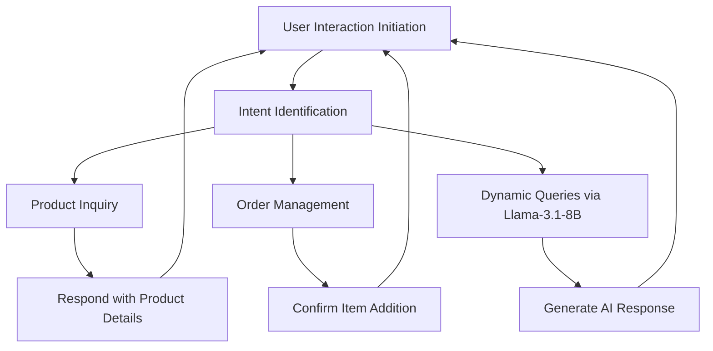

# GreenLife Foods Chatbot

## Overview
A chatbot designed for GreenLife Foods to streamline the order process for distributors and retailers. Built using Python, Streamlit, and Llama-3.1-8B API.

## Setup Instructions
1. Clone the repository.
2. Install dependencies:
   ```bash
   pip install -r requirements.txt

# Sarvam Assignment: AI Agent Assignment

## Long Term Goal
To streamline the order capture process for GreenLife Foods by implementing an AI chatbot that provides product information and facilitates basic order management for distributors and retailers.

---

## Success Criteria
- **Seamless interaction flow**: Accurate responses for end-users.
- **High user satisfaction**: Fast and relevant information retrieval.
- **Improved efficiency**: Increased order processing efficiency and reduced manual effort.
- **Scalability**: A solution that is easily extensible for future feature additions.

---

## Use Case
The AI chatbot for GreenLife Foods enables distributors and retailers to interact seamlessly. Users can:
- Inquire about products.
- Add items to their orders.
- Receive concise product descriptions from a predefined catalog.

With intuitive conversational flows and robust backend integration using the **Llama-3.1-8B model**, this chatbot ensures efficient communication and order management.

---

## Key Steps (Bot Flow)
1. **User Interaction Initiation**: Users send a message via the chatbot interface (e.g., "Tell me about Organic Rice").
2. **Intent Identification**: The chatbot parses the message to identify intent (e.g., product inquiry or adding to an order).
3. **Product Inquiry**: If a product is mentioned, the chatbot fetches details from the catalog and responds.
4. **Order Management**: If the intent is to add an item to an order, the chatbot confirms the addition.
5. **Dynamic Queries**: For inputs outside predefined intents, the chatbot uses the Llama-3.1-8B model to generate an appropriate response.
6. **Exit or Continuation**: Users can either exit or continue with another query.

---

## State Transition Diagram


---

## Bot Features
### Key Specifications
- **Product Information**: Provides details from a catalog of 10-20 items.
- **Basic Order Management**: Handles adding items to orders.
- **Dynamic Response Generation**: Uses the Llama-3.1-8B model for non-standard queries.

### Knowledge Bases (KBs)
- **Product Catalog**: Stored in JSON format.

### Tools Needed
- **Llama-3.1-8B API**: For advanced response generation.

### Supported Languages
- **English**: Default language.

### New Features
- Ability to add items to orders.
- Tuned responses for concise product descriptions.

### Color Coding by Difficulty
- **Green**: Product inquiries and catalog integration.
- **Yellow**: Dynamic query handling with AI.
- **Red**: Advanced order management with payment processing (future scope).

### Integrations Needed
- API integration with Hugging Face for **Llama-3.1-8B**.

---

## Scale-Up / Rollout Strategy
### 1. Testing Phase
- Conduct internal testing with the current catalog and basic queries.
- Perform load testing for API interactions with the Llama-3.1-8B model.

### 2. Pilot Rollout
- Deploy the chatbot for a select group of distributors and retailers.
- Collect user feedback and identify areas for improvement.

### 3. Full Rollout
- Implement changes based on feedback.
- Launch the chatbot for all distributors and retailers.

### 4. Future Enhancements
- Add multi-language support.
- Integrate advanced order management with inventory checks.

---

## Key Challenges
- **LLM API Latency**: Ensuring fast response times despite external API dependencies.
- **Intent Accuracy**: Handling ambiguous user inputs with precision.
- **Scalability**: Supporting a larger catalog and increased user base in the future.
- **Dynamic Query Tuning**: Generating appropriate responses for unexpected queries.
- **User Adoption**: Encouraging distributors and retailers to use the chatbot effectively.

---

## Assumptions
- **Llama-3.1-8B** will be used as the underlying LLM for conversational capabilities.
- Users interact via a web-based interface (built using **Streamlit**).
- A fixed catalog of 10-20 products will be predefined.
- Limited to English language interactions for now.

---

## Limitations
- The chatbot will not handle real-time inventory updates.
- The first version focuses only on distributors/retailers, not end consumers.

---

## Example Conversations
### Scenario 1: Product Inquiry
- **User**: "Tell me about Almond Milk."
- **Bot**: "Almond Milk: $4.99. A healthy dairy alternative rich in vitamins. Would you like to add this to your cart?"

### Scenario 2: Order Placement
- **User**: "Add 2 packs of Quinoa to my order."
- **Bot**: "Added 2 packs of Quinoa to your cart. Total: $25.98. Would you like to place the order now?"

### Scenario 3: Support Inquiry
- **User**: "What is your return policy?"
- **Bot**: "Returns are accepted within 30 days of delivery for unopened items."

---

## Prompt Engineering Approach
To guide **Llama-3.1-8B** effectively:
1. **Clear Role Definition**: Every prompt starts with context, e.g., "You are a helpful assistant for GreenLife Foods, aiding distributors with product details and orders."
2. **Task Clarity**: Specify tasks in plain language, e.g., "Retrieve details about a product and respond conversationally."
3. **Dynamic Inputs**: Combine structured prompts with user queries, e.g., "User asked about {product_name}. Retrieve relevant catalog information and respond."
4. **Refinement via Testing**: Iterative prompt tuning ensures accurate, relevant, and conversational responses.

This approach ensures:
- Accurate product details.
- Seamless order handling.
- Helpful support responses.

---

## GitHub Repository
[Order Manager Chatbot - GitHub Repository](https://github.com/KanhaBhawani/Order-Manager-Chat-Bot/tree/master)
